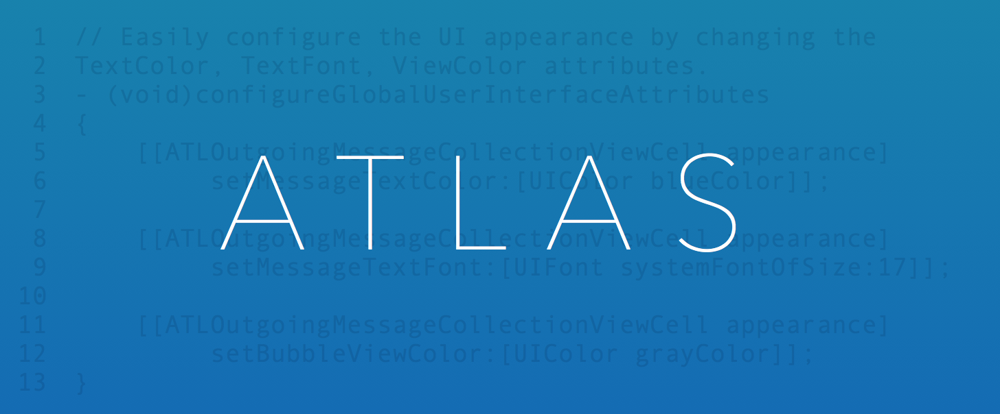
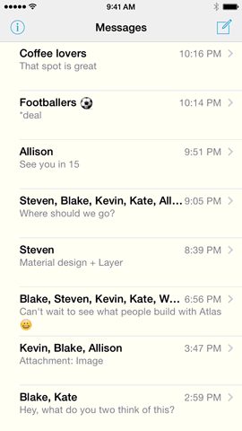

[](https://travis-ci.org/layerhq/Atlas-iOS)
[](http://cocoadocs.org/docsets/Atlas/)
[](http://cocoadocs.org/docsets/Atlas/)
[](https://www.apache.org/licenses/LICENSE-2.0.html)

Atlas is a lightweight, flexible set of user interface components designed to enable developers to quickly and easily integrate native communications experiences into their applications. It was designed and built from the ground up to integrate with [LayerKit](https://github.com/layerhq/releases-ios#layerkit), the native iOS SDK for accessing the [Layer](https://layer.com) communications platform. LayerKit provides developers with a simple, object oriented interface to the rich messaging capabilities provided by the Layer platform. Atlas, in turn, provides ready-made UI components that expose these capabilities directly to users.



## Overview

Atlas provides several complete user interface experiences as well as a large library of individual views. It was designed to address three use cases simulatenously:

1. Provide good looking, high quality implementations of familiar messaging experiences out of the box. By default Atlas is styled to look much like iMessage.
2. Enable quick and easy branding of the user experience via integration with `UIAppearance` and Interface Builder. All fonts, colors, etc. can be customized via an extensive set of `UIAppearance` selectors. This enables developers to quickly add messaging to an existing application and match the components with the existing style.
3. Support full customization of the user interface by enabling developers to plug in their own views in any of the experiences. Developers should be able to implement any design while continuing to leverage the scaffolding that is driving the messaging UI's.

Atlas is deeply and directly integrated with LayerKit. This enables maximum integration with the communications API's and keeps the user interface components very clean, simple and lightweight. LayerKit provides three foundational models (Conversations, Messages, and Message Parts) and a querying system for accessing the messaging data. These models and the querying functionality are used to drive the Atlas UI components.

### Example App

To make it easier to get started with Atlas, we've provided the [Atlas Messenger](https://github.com/layerhq/Atlas-Messenger-iOS) example application. Build instructions accompany the source code on the repository. Alternately, you can check out Atlas within a Layer sandbox of your very own by visiting the [Experience Atlas](https://developer.layer.com/dashboard/signup/atlas) page.

## API Quick Start

The table below details the most important classes in Atlas and is hyperlinked directly to the current header file. All classes are fully documented.

<table>
    <tr><th colspan="2" style="text-align:center;">Controllers</th></tr>
    <tr>
        <td><a href="Code/Controllers/ATLAddressBarViewController.h">ATLAddressBarViewController</a></td>
        <td>A controller that provides a searchable address input experience for selecting users to message.</td>
    </tr>
    <tr>
        <td><a href="Code/Controllers/ATLConversationListViewController.h">ATLConversationListViewController</a></td>
        <td>A controller that provides an editable list of all Conversations for the authenticated user.</td>
    </tr>
    <tr>
        <td><a href="Code/Controllers/ATLConversationViewController.h">ATLConversationViewController</a></td>
        <td>A controller that a scrollable, auto-paginating view of the Messages in a Conversation.</td>
    </tr>
    <tr>
        <td><a href="Code/Controllers/ATLParticipantTableViewController.h">ATLParticipantTableViewController</a></td>
        <td>A controller that provides a sortable, searchable table view for selecting a set of participants to communicate with.</td>
    </tr>
    <tr>
        <td><a href="Code/Controllers/ATLTypingIndicatorViewController.h">ATLTypingIndicatorViewController</a></td>
        <td>A controller that provides a typing indicator view that displays a list of participant names.</td>
    </tr>
    <tr><th colspan="2" style="text-align:center;">Protocols</th></tr>
    <tr>
        <td><a href="Code/Protocols/ATLAvatarItem.h">ATLAvatarItem</a></td>
        <td>A protocol adopted by an object that wishes to represent a user avatar.</td>
    </tr>
    <tr>
        <td><a href="Code/Protocols/ATLConversationPresenting.h">ATLConversationPresenting</a></td>
        <td>A protocol adopted by views that present a Layer Conversation object.</td>
    </tr>
    <tr>
        <td><a href="Code/Protocols/ATLMessagePresenting.h">ATLMessagePresenting</a></td>
        <td>A protocol adopted by views that present a Layer Message object.</td>
    </tr>
    <tr>
        <td><a href="Code/Protocols/ATLParticipant.h">ATLParticipant</a></td>
        <td>A protocol adopted by objects that wish to represent participants in a Converation.</td>
    </tr>
    <tr>
        <td><a href="Code/Protocols/ATLParticipant.h">ATLParticipantPresenting</a></td>
        <td>A protocol adopted by objects that wish to represent participants in a Converation.</td>
    </tr>
    <tr><th colspan="2" style="text-align:center;">Views</th></tr>
    <tr>
        <td><a href="Code/Views/ATLMessageInputToolbar.h">ATLMessageInputToolbar</a></td>
        <td>A input toolbar that provides a dynamic sizing message input interface.</td>
    </tr>
    <tr>
        <td><a href="Code/Views/ATLMessageComposeTextView.h">ATLMessageComposeTextView</a></td>
        <td>A flexible, expanding text view with support for text, images and location data.</td>
    </tr>
</table>

The complete API documentation can be found on [CocoaDocs](http://cocoadocs.org/docsets/Atlas/).

## Installation

Atlas can be installed directly into your application via CocoaPods or by directly importing the source code files. Please note that Atlas has a direct dependency on LayerKit that must be satisfied in order to build the components.

#### CocoaPods Installation

The recommended path for installation is [CocoaPods](http://cocoapods.org/). CocoaPods provides a simple, versioned dependency management system that automates the tedious and error prone aspects of manually configuring libraries and frameworks. You can add Atlas to your project via CocoaPods by doing the following:

```sh
$ sudo gem install cocoapods
$ pod setup
```

Now create a `Podfile` in the root of your project directory and add the following:

```ruby
pod 'Atlas'
```

Complete the installation by executing:

```sh
$ pod install
```

These instructions will setup your local CocoaPods environment and import Atlas into your project.

#### Source Code Installation

If you wish to install Atlas directly into your application from source, then clone the repository and add code and resources to your application:

1. Drag and drop the files from the `Code` and `Resources` directories onto your project, instructing Xcode to copy items into your destination group's folder.
2. Update your project settings to include the linker flags: `-ObjC -lz`
3. Add the following Cocoa SDK frameworks to your project: `'CFNetwork', 'Security', 'MobileCoreServices', 'SystemConfiguration', 'CoreLocation', 'AssetsLibrary', 'ImageIO'`

**Please note that LayerKit is a dependecy of `Atlas`. When manually installing `Atlas`, the same must be done with `LayerKit`. Instructions on doing so can be found in the [LayerKit releases repository](https://github.com/layerhq/releases-ios#framework-installation).**

Build and run your project to verify installation was successful.

## Getting Started

1. **Subclass** - Subclass the [ATLConversationViewController](Code/Controllers/ATLConversationViewController.h) or [ATLConversationListViewController](Code/Controllers/ATLConversationListViewController.h)
2. **Implement** - Both controllers declare delegate and data source protocols. Your subclasses must implement these protocols.
3. **Customize** - The Atlas leverages the `UIAppearance` protocol to allow for effortless customization of components.
4. **Communicate** - Use the LayerKit SDK and the Atlas to build compelling messaging applications.

### MIME Types

Layer Messages include an arbitrary number of message parts. Each message part is transported with a developer assigned MIME Type. Atlas utilizes MIME Type information to determine how to handle a particular message part. Developers must take care to assign an appropriate MIME Type for the content or else Atlas will be unable to handle it. For convenience, Atlas exports a number of constants for the MIME Types it supports:

```objc
NSString *ATLMIMETypeTextPlain; // text/plain
NSString *ATLMIMETypeImagePNG;  // image/png
NSString *ATLMIMETypeImageJPEG;  // image/jpeg
NSString *ATLMIMETypeLocation;  // location
```

## Component Details

### [ATLConversationListViewController](Code/Controllers/ATLConversationListViewController.h)

The [ATLConversationListViewController](Code/Controllers/ATLConversationListViewController.h) provides a customizable `UITableViewController` subclass for displaying a list of Layer conversations. Conversations are represented by a Conversation label, the latest message content, and the latest message date. The controller handles fetching and ordering conversation based on the latest message date.

#### Initialization

The [ATLConversationListViewController](Code/Controllers/ATLConversationListViewController.h) is initialized with a LYRClient object.

```objc
ATLConversationListViewController *viewController = [ATLConversationListViewController conversationListViewControllerWithLayerClient:layerClient];
```

#### Customization

The [ATLConversationListViewController](Code/Controllers/ATLConversationListViewController.h) displays [ATLConversationTableViewCell](Code/Views/ATLConversationTableViewCell.h). The cells themselves provide for customization via `UIAppearance` selectors.

```objc
[[ATLConversationTableViewCell appearance] setConversationLabelFont:[UIFont boldSystemFontOfSize:14]];
[[ATLConversationTableViewCell appearance] setConversationLabelColor:[UIColor blackColor]];
 ```

### [ATLConversationViewController](Code/Controllers/ATLConversationViewController.h)

The [ATLConversationViewController](Code/Controllers/ATLConversationViewController.h) provides a customizable `UICollectionViewController` subclass for displaying individual Layer conversations. The controller is initialized with and `LYRClient` object and an `LYRConversation` object. It handles fetching, displaying and sending messages via LayerKit. The controller leverages the [ATLMessageInputToolbar](Code/Views/ATLMessageInputToolbar.h) object to allow for text and content input.

#### Initialization

```objc
ATLConverationViewController *viewController = [ATLConversationViewController conversationViewControllerWithLayerClient:self.layerClient];
```

#### Customization

The [ATLConverationViewController](Code/Controllers/ATLConversationViewController.h) displays both incoming and outgoing flavors of [ATLMessageCollectionViewCell](Code/Views/ATLMessageCollectionViewCell.h). The cells themselves provide for customization via UIAppearance selectors.

```objc
[[ATLOutgoingMessageCollectionViewCell appearance] setMessageTextColor:[UIColor whiteColor]];
[[ATLOutgoingMessageCollectionViewCell appearance] setMessageTextFont:[UIFont systemFontOfSize:14]];
[[ATLOutgoingMessageCollectionViewCell appearance] setBubbleViewColor:[UIColor blueColor]];
```

### [ATLParticipantTableViewController](Code/Controllers/ATLParticipantTableViewController.h)

The [ATLParticipantTableViewController](Code/Controllers/ATLParticipantTableViewController.h) provides a `UINavigationController` subclass that displays a list of users conforming to the [ATLParticipant](Code/Protocols/ATLParticipant.h) protocol. The controller provides support for sorting and ordering participants based on either first or last name. The controller also provides multi-selection support and an optional selection indicator.

#### Initialization

The [ATLParticipantTableViewController](Code/Controllers/ATLParticipantTableViewController.h) is initialized with a participant list and a sortType.

```objc
ATLParticipantPickerSortType sortType = ATLParticipantPickerSortTypeFirstName;
ATLParticipantTableViewController *controller = [ATLParticipantTableViewController participantTableViewControllerWithParticipants:participants sortType:sortType];
```

#### Customization

The [ATLParticipantTableViewController](Code/Controllers/ATLParticipantTableViewController.h) displays [ATLParticipantTableViewCell](Code/Views/ATLParticipantTableViewCell.h). The cells themselves provide for customization via `UIAppearance` selectors.

```objc
[[ATLParticipantTableViewCell appearance] setTitleColor:[UIColor blackColor]];
[[ATLParticipantTableViewCell appearance] setTitleFont:[UIFont systemFontOfSize:14]];
```

### Presenters

While the Atlas does provide highly customizable TableView and CollectionView cells, advanced customization of the UI components can be done by implementing custom cells and setting the component's `cellClass` property. The Atlas component CollectionView and TableView Cells share a common Presenter pattern where each cell displayed in a Component conforms to a specific presenter protocol. If you would like to swap out the default cells for cells that you build, this can easily accomplished via implementing cells that conform to the presenter patterns and setting the `cellClass` property of the controller.

The presenters are [ATLParticipantPresenting](Code/Protocols/ATLParticipantPresenting.h), [ATLConversationPresenting](Code/Protocols/ATLConversationPresenting.h), and [ATLMessagePresenting](Code/Protocols/ATLMessagePresenting.h).

## Configuring UI Appearance

Atlas takes advantage of Apple's `UIAppearance` protocol which lets you change UI appearance very easily. The following is a list of all Atlas properties conforming to `UIAppearance`:

### [ATLMessageCollectionViewCell](Code/Views/ATLMessageCollectionViewCell.h)
##### ([ATLOutgoingMessageCollectionViewCell](Code/Views/ATLOutgoingMessageCollectionViewCell.h) and [ATLIncomingMessageCollectionViewCell](Code/Views/ATLIncomingMessageCollectionViewCell.h) extend this class)

```objc
@property (nonatomic) UIFont *messageTextFont
@property (nonatomic) UIColor *messageTextColor
@property (nonatomic) UIColor *messageLinkTextColor
@property (nonatomic) UIColor *bubbleViewColor
@property (nonatomic) CGFloat bubbleViewCornerRadius
```

### [ATLAddressBarTextView](Code/Views/ATLAddressBarTextView.h)

```objc
@property (nonatomic) UIFont *addressBarFont
@property (nonatomic) UIColor *addressBarTextColor
@property (nonatomic) UIColor *addressBarHighlightColor
```

### [ATLAvatarImageView](Code/Views/ATLAvatarImageView.h)

```objc
@property (nonatomic) CGFloat avatarImageViewDiameter
@property (nonatomic) UIFont *initialsFont
@property (nonatomic) UIColor *initialsColor
@property (nonatomic) UIColor *imageViewBackgroundColor
```

### [ATLConversationCollectionViewHeader](Code/Views/ATLConversationCollectionViewHeader.h)

```objc
@property (nonatomic) UIFont *participantLabelFont
@property (nonatomic) UIColor *participantLabelTextColor
```

### [ATLConversationTableViewCell](Code/Views/ATLConversationTableViewCell.h)

```objc
@property (nonatomic) UIFont *conversationTitleLabelFont
@property (nonatomic) UIColor *conversationTitleLabelColor
@property (nonatomic) UIFont *lastMessageLabelFont
@property (nonatomic) UIColor *lastMessageLabelColor
@property (nonatomic) UIFont *dateLabelFont
@property (nonatomic) UIColor *dateLabelColor
@property (nonatomic) UIColor *unreadMessageIndicatorBackgroundColor
@property (nonatomic) UIColor *cellBackgroundColor
```

### [ATLParticipantSectionHeaderView](Code/Views/ATLParticipantSectionHeaderView.h)

```objc
@property (nonatomic) UIFont *sectionHeaderFont
@property (nonatomic) UIColor *sectionHeaderTextColor
@property (nonatomic) UIColor *sectionHeaderBackgroundColor
```

### [ATLParticipantTableViewCell](Code/Views/ATLParticipantTableViewCell.h)

```objc
@property (nonatomic) UIFont *titleFont
@property (nonatomic) UIFont *boldTitleFont
@property (nonatomic) UIColor *titleColor
```

## Contributing

Atlas is an Open Source project maintained by Layer. Feedback and contributions are always welcome and the maintainers try to process patches as quickly as possible. Feel free to open up a Pull Request or Issue on Github.

## License

Atlas is licensed under the terms of the [Apache License, version 2.0](http://www.apache.org/licenses/LICENSE-2.0.html). Please see the [LICENSE](LICENSE) file for full details.

## Contact

Atlas was developed in San Francisco by the Layer team. If you have any technical questions or concerns about this project feel free to reach out to [Layer Support](mailto:support@layer.com).

## Credits

* [Kevin Coleman](https://github.com/kcoleman731)
* [Klemen Verdnik](https://github.com/chipxsd)
* [Blake Watters](https://github.com/blakewatters)
